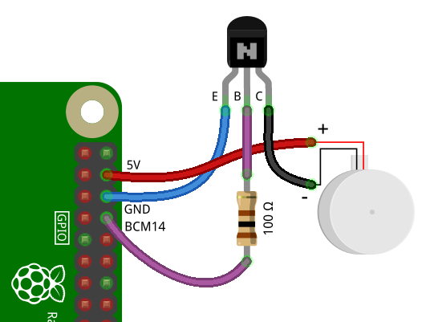

# Умное охлаждение для Raspbery Pi

## Аппаратная часть
1. [Raspbery Pi 3 Model B+](https://www.dns-shop.ru/product/3c9c87fe88973330/mikrokomputer-raspberry-pi-3-model-b/)
2. Резистор **100 Ом**
3. Транзистор:

    - Структура **NPN**
    - Максимальное напряжение база-эмиттер не менее **3,3 В**;
    - Максимальное напряжение коллектор-эмиттер — **не менее 5 В**;
    - Максимальный ток коллектора — **не менее 0,2 А**.
   
        Я использовал транзистор [PN2222](https://www.circuits-diy.com/pn2222-npn-general-purpose-transistor-datasheet/)
4. Вентилятор **30х30мм 5В**

## Схема подключения


## Запуск программы
1. Склонировать репозиторий на ваш Raspberry Pi в любую папку
   ```bash
      git@github.com:kiri11-mi1/raspberry-smart-cooling.git
   ```

2. Внимательно посмотрите на GPIO пин вы подключили базу транзистора, на схеме выше подключено на 14 пин. По умолчанию программа работает с 14 пином. Чтобы запустить скрипт, например на 13 пине, то нужно сделать:
   ```bash
      python main.py -p 13
   ```

3. Программа имеет множество опций работы, чтобы их посмотреть, введите:
   ```bash
      python main.py -h
   ```

   Вывод:
   ```
   usage: main.py [-h] [-t TEMPERATURE] [-te TIME_END] [-tb TIME_BEGIN] [-p PIN] [-dt DELTA_TEMP]
   
   CLI interface for control smart cooling
   
   optional arguments:
     -h, --help            show this help message and exit
     -t TEMPERATURE, --temperature TEMPERATURE
                           Max temperature CPU without fan cooling, default temp=60 C
     -te TIME_END, --time_end TIME_END
                           The hours after which the board will be turned off, default time_end=24
     -tb TIME_BEGIN, --time_begin TIME_BEGIN
                           The hours after which the board will be turned on, default time_begin=8
     -p PIN, --pin PIN     Value for control pin in your board, default pin=14
     -dt DELTA_TEMP, --delta_temp DELTA_TEMP
                           The value of how many degrees should be cooled, default dt=15
   ```

### Пример
```bash
   python main.py -p 13 -tb 8 -te 1 -t 55 -dt 15
```
Данный запуск скрипта говорит о следующем:
1. `-p 13` - база транзистора подключена на 13 пин
2. `-tb 8 -te 1` - при наступлении 8 утра умное охлаждение будет активировано до 1 ночи
3. `-t 55` - в рабочие часы умного охлаждения, вентилятор будет включаться только тогда, когда температура процессора будет равна 55 градусам
4. `-dt 15` - когда включится вентилятор, он будет работать до тех пор, пока температура процессора не опуститься **НА 15 градусов** 

## Заюзаем systemd
Поскольку в RPi стоит [Debian](https://ru.wikipedia.org/wiki/Debian) дистрибутив - [Raspbery Pi OS](https://ru.wikipedia.org/wiki/Raspberry_Pi_OS), то в ней есть systemd.
Используем это с той целью, чтобы наш скрипт работал при каждом перезапуске системы, а так же затем, чтобы смотреть логи.

1. Создадим файл сервиса systemd
   ```bash
      sudo nano /etc/systemd/system/smart_cooler.service
   ```
2. Заполните файл сервиса
   ```
   [Unit]
   Description=Smart cooling for RPi
   After=syslog.target
   After=network.target
   
   [Service]
   Type=simple
   User=root
   WorkingDirectory=/YOUR_PATH_TO_PROJECT_DIR/
   ExecStart=/usr/bin/python /YOUR_PATH_TO_PROJECT_DIR/main.py -t 55 -te 1
   RestartSec=10
   Restart=always
   
   [Install]
   WantedBy=multi-user.target
   
   ```
   Поменяйте путь к рабочей директории и путь к файлу `main.py`, а так же введите свои параметры работы охлаждения. Затем нажмите `Ctrl+O`. Затем `Enter`. И наконец выйдиите из редактора `nano` комбинацией клавиш `Ctrl+X`.

3. Далее нужно по очереди выполнить команды:
   ```bash
      systemctl daemon-reload
      systemctl enable smart_cooler
      systemctl start smart_cooler
   ```

4. Чтобы посмотреть логи работы программы, введите:
   ```bash
      systemctl status smart_cooler
   ```

   Вывод:
   ```
   ● smart_cooler.service - Smart cooling for RPi
     Loaded: loaded (/etc/systemd/system/smart_cooler.service; enabled; vendor preset: enabled)
     Active: active (running) since Sat 2022-12-24 03:13:05 +07; 3 days ago
   Main PID: 38361 (python)
      Tasks: 1 (limit: 779)
        CPU: 1h 43min 15.704s
     CGroup: /system.slice/smart_cooler.service
             └─38361 /usr/bin/python /home/kiri11-mi1/raspberry-smart-cooling/main.py -t 55 -te 1

   дек 27 13:27:22 raspberrkirill python[38361]: INFO:root:| Fan state: False | Current temp: 41.9 |
   дек 27 13:27:23 raspberrkirill python[38361]: INFO:root:| Fan state: False | Current temp: 41.9 |
   дек 27 13:27:24 raspberrkirill python[38361]: INFO:root:| Fan state: False | Current temp: 42.4 |
   дек 27 13:27:25 raspberrkirill python[38361]: INFO:root:| Fan state: False | Current temp: 42.4 |
   дек 27 13:27:26 raspberrkirill python[38361]: INFO:root:| Fan state: False | Current temp: 42.9 |
   дек 27 13:27:27 raspberrkirill python[38361]: INFO:root:| Fan state: False | Current temp: 42.9 |
   дек 27 13:27:28 raspberrkirill python[38361]: INFO:root:| Fan state: False | Current temp: 42.9 |
   дек 27 13:27:29 raspberrkirill python[38361]: INFO:root:| Fan state: False | Current temp: 42.9 |
   дек 27 13:27:30 raspberrkirill python[38361]: INFO:root:| Fan state: False | Current temp: 42.9 |

   ```

### На этом настройка и запуск скрипта завершена